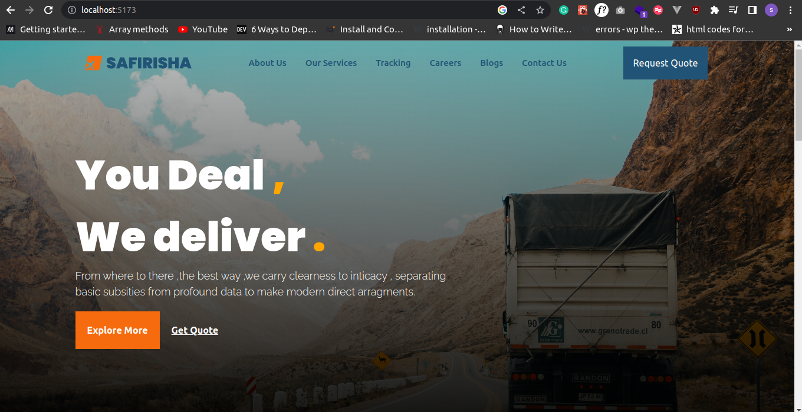

# Safirisha React

## Introduction

Safirisha React is a logistics and shipping company website built using Vite, React, and Tailwind CSS. The backend is currently being developed in Ruby and will be added soon.

## Table of Contents

- [Installation](#installation)
- [Usage](#usage)
- [Contributing](#contributing)
- [License](#license)

## Installation

To install and run this project on your local machine, follow these steps:

1. Clone this repository with `git clone https://github.com/king-kanda/Safirisha_React.git`
2. Navigate to the project directory with `cd Safirisha_React`
3. Install the dependencies with `npm install`
4. Start the development server with `npm run dev`
5. Open `http://localhost:3000 or 5173 ` in your browser to view the project

## Usage

Once the project is up and running, you can use the package tracking and delivery services provided by the website. Simply navigate to the tracking page, enter your package tracking code, and click "Track". You can also view information about the company, its services, and careers on the corresponding pages.

## Contributing

Contributions to this project are welcome and encouraged. To contribute, follow these steps:

1. Fork this repository
2. Create a new branch with `git checkout -b new-feature`
3. Make your changes and commit them with `git commit -m "Add new feature"`
4. Push your changes to your fork with `git push origin new-feature`
5. Create a pull request on this repository

## License

This project is licensed under the [MIT License](https://opensource.org/licenses/MIT).

Happy hacking !!

